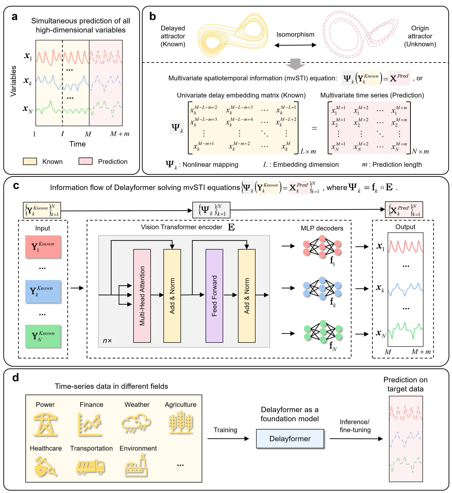

# Delayformer: spatiotemporal transformation for predicting high-dimensional dynamics
**Delayformer** is designed to predict the dynamics of all variables simultaneously by introducing a novel **multivariate spatiotemporal information (mvSTI)** transformation. 
This transformation converts each observed variable into a delay-embedded state (vector) and facilitates cross-learning of these states across different variables. 
From the perspective of dynamical systems, Delayformer focuses on predicting **system states** rather than individual variables. This approach effectively addresses challenges related to nonlinearity and cross-variable interactions, both theoretically and computationally.
## Structure of Delayformer

Previous spatiotemporal information (STI) transformation studies focused on univariate prediction, and thus, we proposed multivariate spatiotemporal information (mvSTI) transformation in this work (Figure b). Delayformer is designed for solving mvSTI (Figure c), which adopts an patching strategy silimilar like Vision Transformer (ViT), an encoder-only structure, and channel indepedence.
## Synthetic data used in Delayformer
In the experiments, we generated time series data of Lorentz systems in the same way as ARNN[1](#refer-anchor-1), including time-invariant Lorentz system. 
## Using Delayformer
The benchmark datasets used in Delayformer can be obtained in Time-Series-Library[2](#refer-anchor-2).
***
Training and evaluation

We provide all the scripts for the results exhibits in the paper, which can be found in `./scripts/` folder. Our training and evaluation outputs can be found in`./results/` folder corresponding to the paper. You can run the `.sh` files after downloading the datasets and puting them into `./datasets/` folder.
***

## Reference
[1] https://github.com/RPcb/ARNN.  
[2] https://github.com/thuml/Time-Series-Library. 
